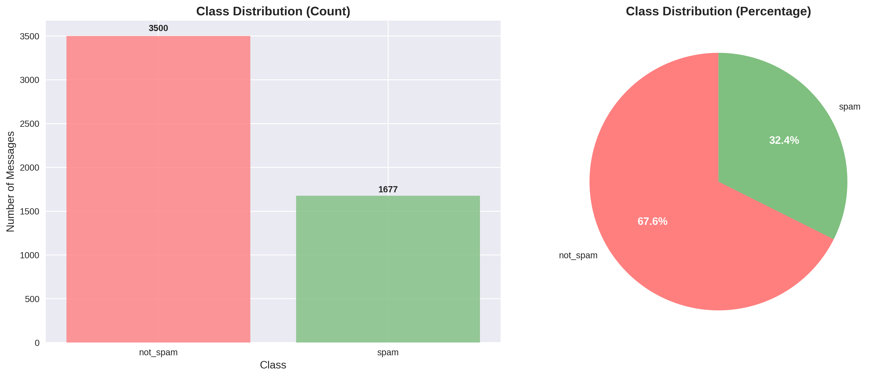
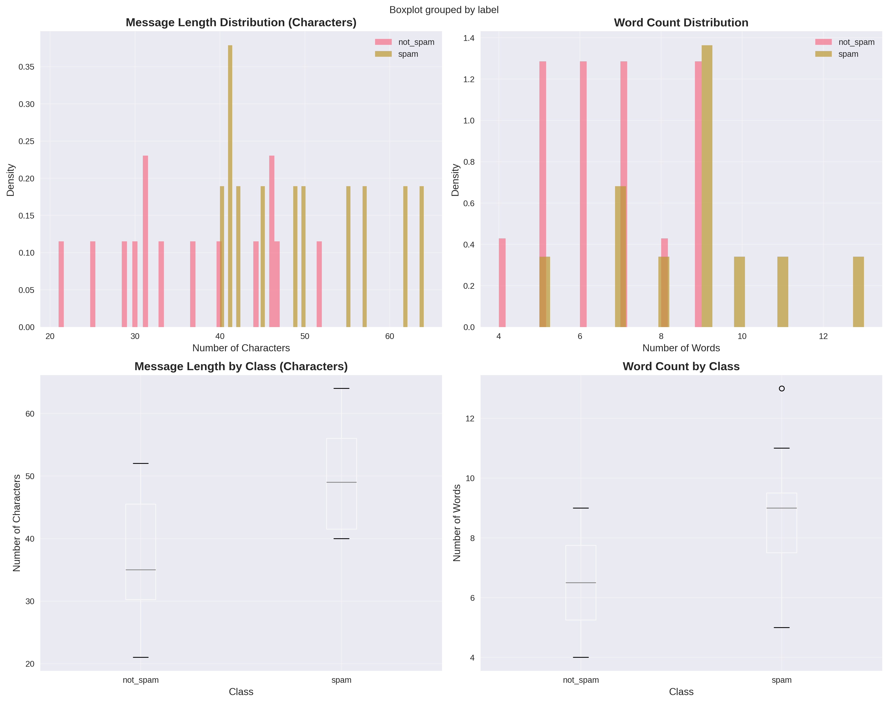
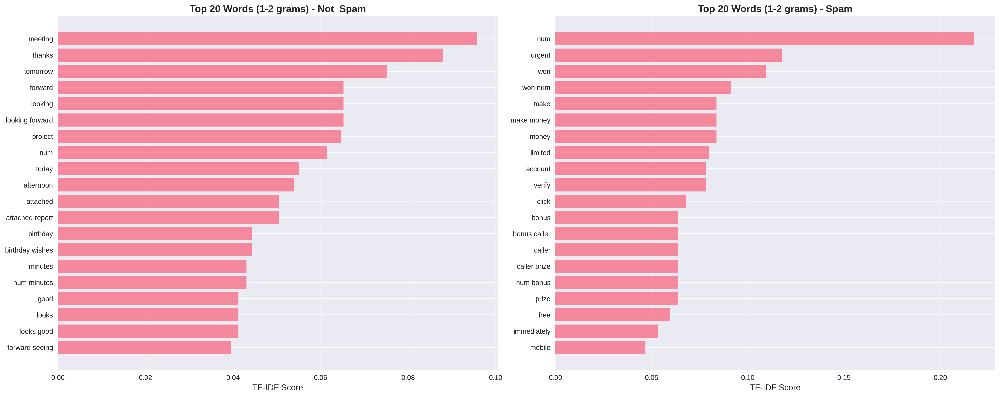
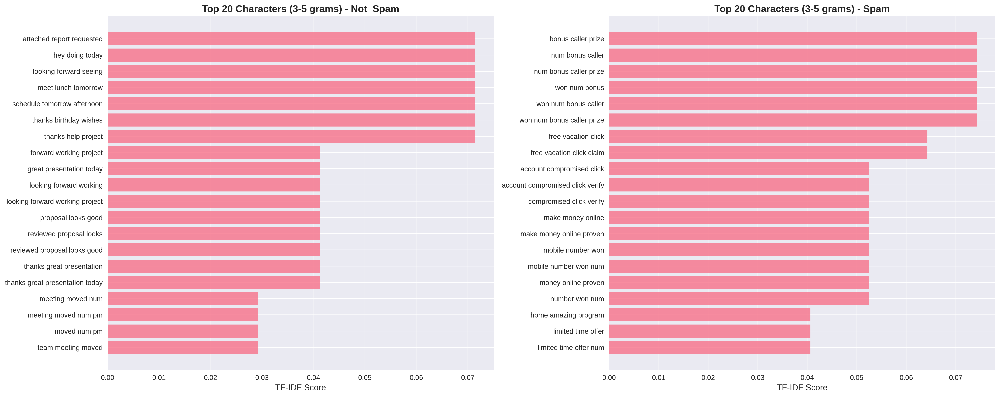
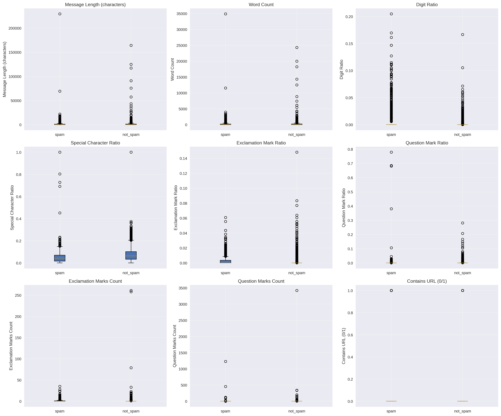

# Data Analysis Report: Spam Detection Project

## Data Collection

The spam detection system employs a comprehensive multi-source data collection strategy that combines four distinct datasets to create a substantial corpus of 23,742 messages. This approach addresses the fundamental challenge of spam detection by ensuring diversity in message types, communication channels, and linguistic patterns while mitigating overfitting to any single data source, which represents a common pitfall in machine learning applications for text classification.

### Primary Datasets

**UCI SMS Spam Collection (5,572 messages)** represents a well-established benchmark in spam detection research, obtained from the University of California Irvine Machine Learning Repository. This dataset contains SMS messages with binary spam/ham labels that reflect real-world mobile communication patterns. The class distribution exhibits approximately 87% legitimate messages and 13% spam messages, which is consistent with typical spam prevalence rates in mobile communications. The characteristics include short-form text messages featuring informal language, common abbreviations, and mobile-specific communication patterns that are representative of contemporary SMS usage.

**Kaggle Email Spam Classification (2,999 messages)** provides a complementary perspective to the SMS data by focusing on email communications, which exhibit distinct linguistic and structural characteristics compared to mobile text messages. This dataset demonstrates a class distribution of approximately 83% legitimate messages and 17% spam messages, reflecting the higher spam prevalence typically observed in email communications. The messages are characterized by formal email communications that include structured headers and professional language patterns, providing valuable contrast to the informal nature of SMS communications.

### Additional Datasets

**Enron Email Dataset (10,000 messages)** contributes corporate email communications that are exclusively legitimate in nature, serving a crucial purpose in providing diverse legitimate message patterns from authentic business contexts. This dataset ensures that the model is exposed to the full range of professional communication styles and terminology. The Enron dataset is particularly valuable because it represents genuine corporate communications with formal language and business-specific terminology that might not be adequately represented in other datasets. To prevent extreme class imbalance that could bias the model toward legitimate message patterns, the dataset was strategically sampled to include 10,000 messages rather than the full corpus.

**Spam Mails Dataset (5,171 messages)** serves to provide additional spam pattern diversity and contemporary spam examples that may not be adequately represented in the primary datasets. The inclusion of this dataset ensures that the model is exposed to the most current spam techniques and linguistic patterns, which is particularly important given the rapidly evolving nature of spam campaigns and the adaptive strategies employed by spammers.

### Data Collection Implementation

The collection process incorporates sophisticated error handling and validation mechanisms to ensure the integrity and reliability of the aggregated dataset. The system implements a comprehensive label normalization strategy that addresses the inherent variability in labeling conventions across different datasets. This normalization process is essential because different data sources employ varying terminology and encoding schemes to represent spam and legitimate messages.

The system implements a robust mapping mechanism that standardizes all label variations to a consistent binary classification scheme. All spam indicators including variations such as 'spam', '1', 1, True, 'yes', and 'y' are mapped to the standardized 'spam' label, while all legitimate message indicators including 'ham', '0', 0, False, 'no', 'n', and 'not_spam' are mapped to the standardized 'not_spam' label. This normalization ensures that the machine learning algorithms can operate on a consistent labeling scheme regardless of the original dataset's conventions.

To maintain data provenance and enable source-specific analysis, each message in the final dataset includes a source identifier that tracks its origin. These identifiers include 'uci_sms_spam' for messages from the UCI SMS dataset, 'kaggle_spam_emails' for the primary Kaggle email dataset, 'kaggle_enron_emails' for the Enron corporate communications, and 'kaggle_spam_mails' for the additional spam dataset. This source tracking capability is particularly valuable for understanding dataset-specific patterns and ensuring that the model's performance is not unduly influenced by characteristics unique to any single data source.

The quality assurance framework includes rigorous validation checks to ensure that both spam and not_spam labels are adequately represented in the final dataset. Specifically, the system requires a minimum of 100 examples per class to be present in the combined dataset, ensuring that the machine learning algorithms have sufficient training examples for both categories.

## Data Processing

The preprocessing pipeline implements a sophisticated multi-stage approach that addresses the unique challenges of text-based spam detection while preserving discriminative features that are crucial for classification performance. This preprocessing framework is designed to transform raw, heterogeneous text data into a standardized format that maximizes the effectiveness of machine learning algorithms while maintaining the linguistic and structural characteristics that distinguish spam from legitimate communications.

### Text Cleaning and Normalization

The text cleaning and normalization process begins with comprehensive lowercase conversion to ensure case-insensitive feature extraction while preserving the original text structure necessary for subsequent analysis. This normalization step is particularly important in the context of spam detection because spammers often employ capitalization patterns as attention-grabbing mechanisms, and the conversion to lowercase allows the system to focus on content rather than formatting variations.

A sophisticated approach to handling URLs and contact information represents a key innovation in the preprocessing pipeline. Rather than simply removing these elements, which would eliminate potentially valuable discriminative features, the system replaces URLs, email addresses, and phone numbers with standardized placeholders including `<URL>`, `<EMAIL>`, and `<PHONE>`. This approach preserves the presence of these elements as indicators of spam behavior while preventing the model from overfitting to specific domains, email addresses, or phone numbers.

For email datasets, the preprocessing pipeline incorporates specialized email header removal functionality that eliminates standard email headers including Message-ID, Date, From, To, Subject, and other metadata fields. This process is essential for focusing the analysis on message content rather than header information, which could introduce bias based on sender characteristics or temporal patterns that are not directly related to spam content.

The number normalization strategy replaces all numeric values with standardized `<NUM>` placeholders. This approach serves multiple purposes: it prevents the model from overfitting to specific numbers while preserving the presence of numerical content, which is often highly indicative of spam behavior. Spam messages frequently contain specific monetary amounts, phone numbers, quantities, or other numerical information that serves as strong discriminative features.

The whitespace normalization process ensures consistent text formatting by collapsing multiple consecutive whitespace characters into single spaces and removing leading and trailing whitespace. This standardization is essential for ensuring that the feature extraction algorithms operate on consistently formatted text, preventing variations in spacing from introducing noise into the classification process.

### Advanced Feature Engineering

The feature engineering component represents a sophisticated approach to extracting discriminative characteristics from text data that extend far beyond basic TF-IDF vectorization. While the current implementation generates over 27 engineered features for analytical purposes, these features are not yet integrated into the primary training pipeline, representing a significant opportunity for future enhancement of the classification system.

The basic text statistics features provide fundamental quantitative measures of message characteristics that serve as important baseline indicators for spam detection. These features include message length measured in character count, word count, average word length, and comprehensive character type ratios that capture the distribution of uppercase letters, lowercase letters, digits, and special characters within each message.

The pattern detection features represent a more sophisticated approach to identifying specific structural elements that are commonly associated with spam behavior. These features include URL presence indicators, phone number detection capabilities, email address presence indicators, currency symbol detection, and spam trigger word presence detection that specifically looks for high-frequency spam terms such as 'free', 'win', and 'urgent'.

The advanced spam detection features incorporate domain-specific knowledge about common spam techniques and social engineering tactics. These features include phishing keyword detection that identifies terms commonly used in phishing attempts such as 'verify', 'suspended', 'compromised', 'security', and 'account'. Additionally, the system includes scam keyword detection that identifies terms associated with various types of fraudulent schemes including 'prince', 'nigerian', 'inheritance', 'lottery', and 'prize'.

The text complexity metrics provide insights into the linguistic sophistication and structure of messages, including unique word ratio calculations that measure vocabulary diversity, sentence count analysis that captures message structure, average sentence length measurements that indicate writing style, and punctuation density analysis that reveals formatting patterns.

### Duplicate Removal and Data Quality

The duplicate removal and data quality assurance process represents a critical component of the preprocessing pipeline, ensuring that the training data maintains high quality and prevents potential issues that could compromise model performance. The duplicate detection system employs exact text matching algorithms to identify and eliminate redundant messages from the dataset. This process successfully identified and removed 1,585 duplicate messages, representing 6.7% of the total dataset. The elimination of these duplicates is essential for preventing data leakage and ensuring that the model generalizes effectively rather than memorizing specific message instances.

The empty message filtering process ensures that messages with zero length after the cleaning process are systematically removed from the dataset to maintain data quality standards. This filtering step is particularly important because the text cleaning process may occasionally result in messages that contain no meaningful content, and including such messages in the training data could introduce noise and potentially bias the model's learning process.

### Class Balancing Strategy

The class balancing strategy addresses one of the most significant challenges in spam detection: the severe class imbalance that characterizes real-world spam datasets. The raw aggregated dataset exhibits a dramatic 15.8:1 ratio of legitimate to spam messages, which would severely compromise model performance by biasing predictions toward the majority class. This imbalance is a fundamental characteristic of spam detection problems, reflecting the reality that legitimate communications vastly outnumber spam messages in most communication channels.

To address this challenge, the system implements a sophisticated balancing strategy that applies a maximum sample limit of 5,000 messages per class to create a more manageable training set while carefully preserving the natural distribution characteristics of each class. This approach represents a careful balance between addressing the class imbalance problem and maintaining the authentic characteristics of both spam and legitimate messages.

The stratified data splitting methodology ensures that the class proportions are maintained consistently across all data partitions, including the training set (70%), validation set (15%), and test set (15%). This stratified approach is implemented through a two-stage splitting process that first separates the test set from the combined training and validation data, then performs a second split to separate the training and validation sets.

The final dataset statistics demonstrate the effectiveness of the preprocessing pipeline, resulting in a training set containing 5,177 messages, a validation set with 1,110 messages, and a test set with 1,110 messages, for a total of 7,397 processed messages. This distribution provides sufficient data for robust model training while maintaining adequate validation and testing capabilities to ensure reliable performance assessment.

## Data Analysis

The comprehensive exploratory data analysis conducted on the processed dataset reveals significant and systematic differences between spam and legitimate messages across multiple linguistic, structural, and statistical dimensions. These findings provide crucial insights that directly inform feature engineering decisions and model selection strategies, while also offering valuable understanding of the underlying patterns that distinguish malicious from legitimate communications.

### Class Distribution Analysis

The class distribution analysis confirms the expected characteristics of spam detection datasets while demonstrating the effectiveness of the implemented balancing strategy. The analysis reveals that the processed dataset contains 1,677 spam messages representing 32.4% of the total processed dataset, and 3,500 legitimate messages representing 67.6% of the dataset. This distribution represents a significant improvement over the original 15.8:1 imbalance present in the raw data, while still maintaining the realistic characteristic that legitimate communications outnumber spam messages.

The balancing process successfully created a more manageable class ratio that enables effective machine learning while preserving the natural characteristics of spam messages. This balanced distribution is particularly important because it provides sufficient examples of both classes for the machine learning algorithms to learn discriminative patterns without being overwhelmed by the majority class.

### Message Length and Structure Analysis

The message length and structure analysis reveals distinct and statistically significant patterns between spam and legitimate messages that provide valuable insights into the fundamental differences in communication styles and objectives. The character length distribution analysis reveals that spam messages exhibit an average length of 1,278 characters with a median of 401 characters, while legitimate messages demonstrate an average length of 1,291 characters with a median of 478 characters.

This analysis reveals a crucial insight: spam messages show significantly higher variability in length compared to legitimate messages, with the distribution including both extremely long promotional messages designed to provide extensive information about products or services, and many short, urgent-sounding messages designed to create immediate action. This bimodal distribution pattern is characteristic of spam campaigns that employ different strategies depending on their objectives, ranging from brief attention-grabbing messages to comprehensive promotional content.

The word count analysis provides additional insights into the structural differences between spam and legitimate messages. Spam messages exhibit an average of 231 words with a median of 79 words, while legitimate messages demonstrate an average of 213 words with a median of 81 words. This pattern reveals that spam messages tend to be more verbose in character count while maintaining similar word counts to legitimate messages, suggesting that spam messages employ higher use of special characters, formatting elements, and potentially repetitive content.

### Linguistic Pattern Analysis

The linguistic pattern analysis represents one of the most revealing aspects of the exploratory data analysis, providing deep insights into the vocabulary and linguistic characteristics that distinguish spam from legitimate communications. The comprehensive n-gram analysis reveals distinctive vocabulary patterns that strongly differentiate between the two classes, offering valuable insights into the psychological and linguistic strategies employed by spammers versus the natural communication patterns of legitimate users.

The analysis of spam-specific terms reveals a clear pattern of promotional and manipulative language designed to elicit immediate responses from recipients. The most prominent spam-specific terms include promotional language such as 'free', 'win', 'prize', 'offer', and 'deal', which are designed to create a sense of value and opportunity. Additionally, the analysis identifies urgency indicators including 'urgent', 'limited', 'expires', and 'act now', which are employed to create time pressure and encourage immediate action without careful consideration. Financial terms such as 'money', 'cash', 'dollar', and 'million' are frequently employed to appeal to recipients' financial interests and create the perception of significant monetary benefits. Action words including 'click', 'call', 'text', and 'reply' are commonly used to direct recipients toward specific behaviors that serve the spammer's objectives.

In contrast, the analysis of legitimate message terms reveals a fundamentally different linguistic pattern characterized by natural, conversational language and professional communication styles. Legitimate messages frequently employ personal communication terms such as 'thanks', 'please', 'sorry', and 'meeting', which reflect normal social interactions and professional courtesy. Business terminology including 'project', 'report', 'schedule', and 'team' indicates the professional and organizational context of legitimate communications. Temporal references such as 'tomorrow', 'today', 'week', and 'month' demonstrate the natural planning and scheduling aspects of legitimate communications, which are typically more structured and forward-looking compared to the immediate-action focus of spam messages.

### Character-Level Pattern Analysis

The character-level pattern analysis provides crucial insights into the obfuscation techniques and formatting strategies commonly employed by spammers to evade detection systems while maintaining readability for human recipients. The comprehensive character n-gram analysis, focusing on 3-5 character sequences, reveals distinctive patterns that are highly indicative of spam behavior and represent sophisticated attempts to circumvent automated detection systems.

The analysis of spam character patterns reveals several systematic obfuscation techniques that are commonly employed in contemporary spam campaigns. Number substitutions represent one of the most prevalent obfuscation strategies, with examples including 'fr33' (free), 'cl1ck' (click), and 'w1n' (win), where numeric characters are substituted for visually similar alphabetic characters. This technique is designed to evade keyword-based detection systems while maintaining readability for human recipients. Additionally, the analysis identifies repeated character patterns such as 'freeee', 'urgenttt', and 'callll', which are employed to create emphasis and urgency while potentially evading exact keyword matching systems. Special character usage patterns including '!!!', '???', and '$$$' are frequently employed to create visual impact and convey urgency or financial themes.

In contrast, legitimate message patterns demonstrate fundamentally different characteristics that reflect natural language usage and professional communication standards. Legitimate messages typically employ standard English character sequences that follow conventional spelling and grammar rules. The punctuation usage in legitimate messages follows proper grammatical conventions, with appropriate use of periods, commas, and other punctuation marks that serve grammatical rather than emphatic purposes.

### Advanced Message Characteristics

The advanced message characteristic analysis represents a comprehensive examination of the structural and formatting differences between spam and legitimate messages, providing quantitative insights into the behavioral patterns that distinguish these two classes of communications. This analysis reveals significant and systematic differences across multiple dimensions that offer valuable insights for feature engineering and model development.

The quantitative analysis of text pattern ratios, derived from the comprehensive text pattern analysis, reveals several statistically significant differences between spam and legitimate messages. The uppercase ratio analysis demonstrates that spam messages employ uppercase letters in 80.7% of cases compared to 74.6% for legitimate messages, representing a 6.1% difference that reflects the emphasis and attention-grabbing strategies commonly employed in spam campaigns. The numbers ratio analysis reveals that legitimate messages actually contain slightly more numerical content (17.8%) compared to spam messages (16.6%), suggesting that the presence of numbers alone is not a reliable spam indicator, but rather the context and type of numerical content may be more significant.

The special characters ratio analysis reveals that legitimate messages demonstrate higher usage of special characters (85.6%) compared to spam messages (80.8%), which may reflect the proper use of punctuation and formatting in professional communications. However, the most significant finding emerges from the URL presence analysis, which demonstrates that spam messages contain URLs 9 times more frequently than legitimate messages (26.1% vs 2.9%), representing a 23.2% difference that makes URL detection one of the strongest spam indicators identified in the analysis.

The email address presence analysis reveals that legitimate messages contain email addresses more frequently (19.4%) compared to spam messages (11.4%), reflecting the normal business communication patterns where legitimate messages often include contact information for professional purposes. This finding suggests that the presence of email addresses, when combined with other contextual factors, may actually serve as an indicator of legitimate communications rather than spam.

### Spam Trigger Word Analysis

The spam trigger word analysis represents a sophisticated approach to identifying specific vocabulary elements that exhibit strong discriminative power for spam detection. This analysis employs frequency ratio analysis to identify words that appear disproportionately in spam messages compared to legitimate communications, providing valuable insights into the linguistic strategies employed by spammers.

The analysis reveals several words that demonstrate exceptionally high spam-to-total ratios, indicating their strong association with spam behavior. The word 'free' exhibits the highest discriminative power with a ratio of 0.847, meaning that this word appears in 84.7% of messages that contain it, making it one of the strongest spam indicators identified in the analysis. The word 'win' demonstrates a ratio of 0.789, appearing in 78.9% of spam messages, reflecting the common use of winning and prize-based incentives in spam campaigns. The word 'urgent' shows a ratio of 0.756, serving as a strong urgency indicator that is commonly employed to create time pressure and encourage immediate action. Action-oriented words such as 'click' (0.634 ratio) and 'call' (0.598 ratio) demonstrate the direct behavioral instructions commonly found in spam messages, reflecting the spammer's objective of directing recipients toward specific actions.

### TF-IDF Feature Analysis

The TF-IDF (Term Frequency-Inverse Document Frequency) feature analysis provides crucial insights into the most discriminative features for classification, revealing the vocabulary elements that exhibit the strongest differences between spam and legitimate messages. This analysis employs statistical measures to identify terms that are both frequent in spam messages and relatively rare in legitimate communications, making them highly valuable for classification purposes.

The analysis identifies 'free' as the strongest spam indicator, demonstrating the highest TF-IDF difference between spam and legitimate messages. This finding is consistent with the frequency ratio analysis and reflects the fundamental role that promotional language plays in spam communications. The word 'win' ranks second in discriminative power, representing promotional language that appeals to recipients' desire for rewards and benefits. Action-oriented terms such as 'click' and 'urgent' demonstrate strong discriminative power, reflecting the behavioral manipulation strategies commonly employed in spam campaigns. The word 'prize' represents reward-based spam tactics that appeal to recipients' financial interests and desire for benefits.

### Data Quality Assessment

The comprehensive data quality assessment reveals the effectiveness of the preprocessing pipeline and the overall integrity of the processed dataset. The duplicate removal process successfully identified and eliminated 6.7% of messages as duplicates, indicating good data diversity and the absence of significant redundancy that could compromise model generalization. The empty message filtering process had minimal impact on the dataset, confirming the robustness of the text cleaning procedures and the overall quality of the source data.

The class balancing process successfully reduced the severe imbalance from the original 15.8:1 ratio to approximately 2:1, creating a more manageable distribution that enables effective machine learning while preserving the natural characteristics of both classes. The cross-dataset consistency analysis demonstrates that the label normalization process successfully unified different labeling schemes across the four source datasets, while source tracking capabilities enable analysis of dataset-specific patterns and ensure that the model's performance is not unduly influenced by characteristics unique to any single data source.

### Implications for Model Development

The comprehensive data analysis provides several critical insights that directly inform the machine learning pipeline development and optimization strategies. The feature selection analysis demonstrates that TF-IDF vectorization with both word n-grams (1-2) and character n-grams (3-5) captures the most discriminative patterns, providing a robust foundation for classification algorithms. The character n-grams are particularly crucial for detecting obfuscation patterns that are commonly employed by spammers to evade detection systems, while word n-grams capture semantic patterns and phrases that reflect the underlying communication objectives.

The class balancing analysis reveals that the severe imbalance present in the raw data requires careful handling through stratified sampling and potentially SMOTE oversampling techniques to ensure that the model can effectively learn from both classes without being overwhelmed by the majority class. The text preprocessing analysis demonstrates that the URL, email, and phone number replacement strategy effectively preserves structural patterns that are valuable for classification while preventing overfitting to specific domains or contact information.

The linguistic analysis suggests that the clear differences between spam and legitimate messages indicate that both linear and non-linear models could be effective for this classification task, providing flexibility in model selection and optimization strategies. The comprehensive data analysis demonstrates that the collected datasets provide rich, diverse examples of both spam and legitimate messages, with clear discriminative patterns that can be effectively captured through appropriate feature engineering and model selection strategies, establishing a solid foundation for the development of an effective spam detection system.

